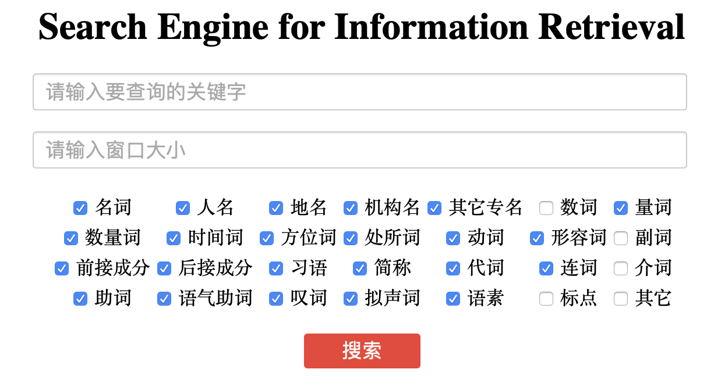

# IRHomeWork

Big homework for Information Retrieval.

## Dependency

+ Python: 3.7
+ Flask: 1.1.1
+ Elasticsearch: 7.1.0
+ Elasticsearch-full: 7.5

## How To RUN?

1. Start elasticsearch server

```shell
/usr/local/bin/elasticsearch
```

2. Edit config

edit `config.py`

```python
maps # index setting
files_to_handle # source file of corpus. Be preprocessed by thulac
```

3. Build index

```shell
python3 build_index.py
```

4. Run application

After build index, run application

**WARN:** Use the same index name in `app.py` and `build_index.py`

```shell
python3 app.py
```

Then open http://localhost:5000 in your browser. You can see following page.



