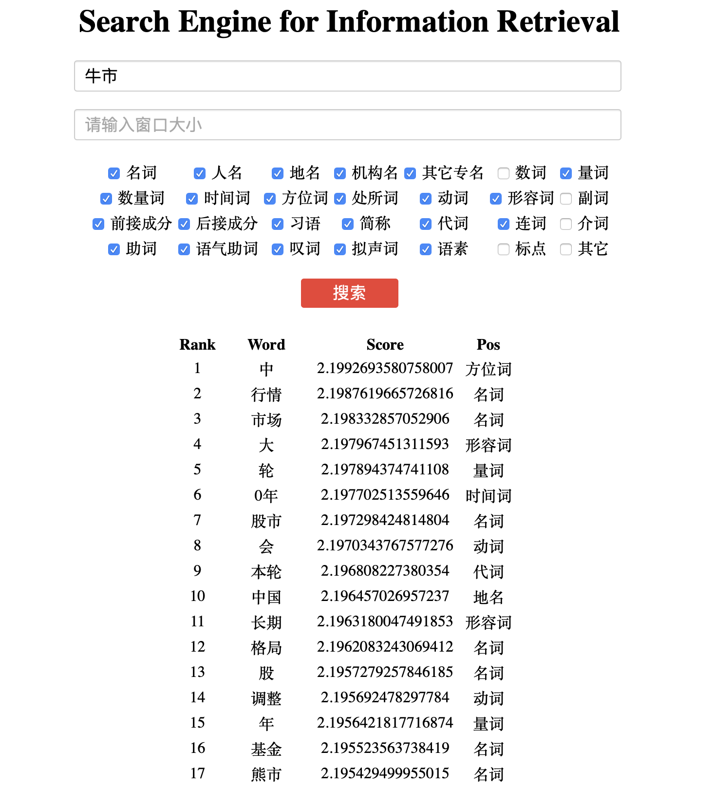
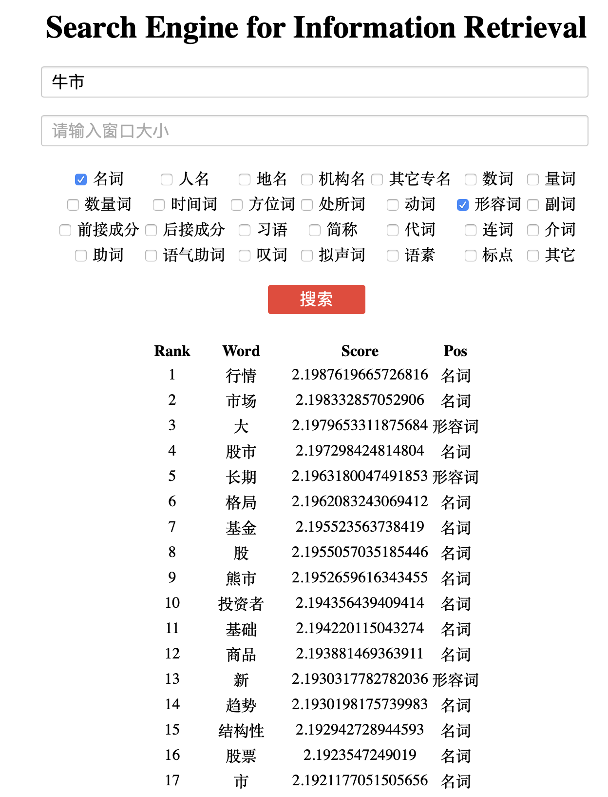
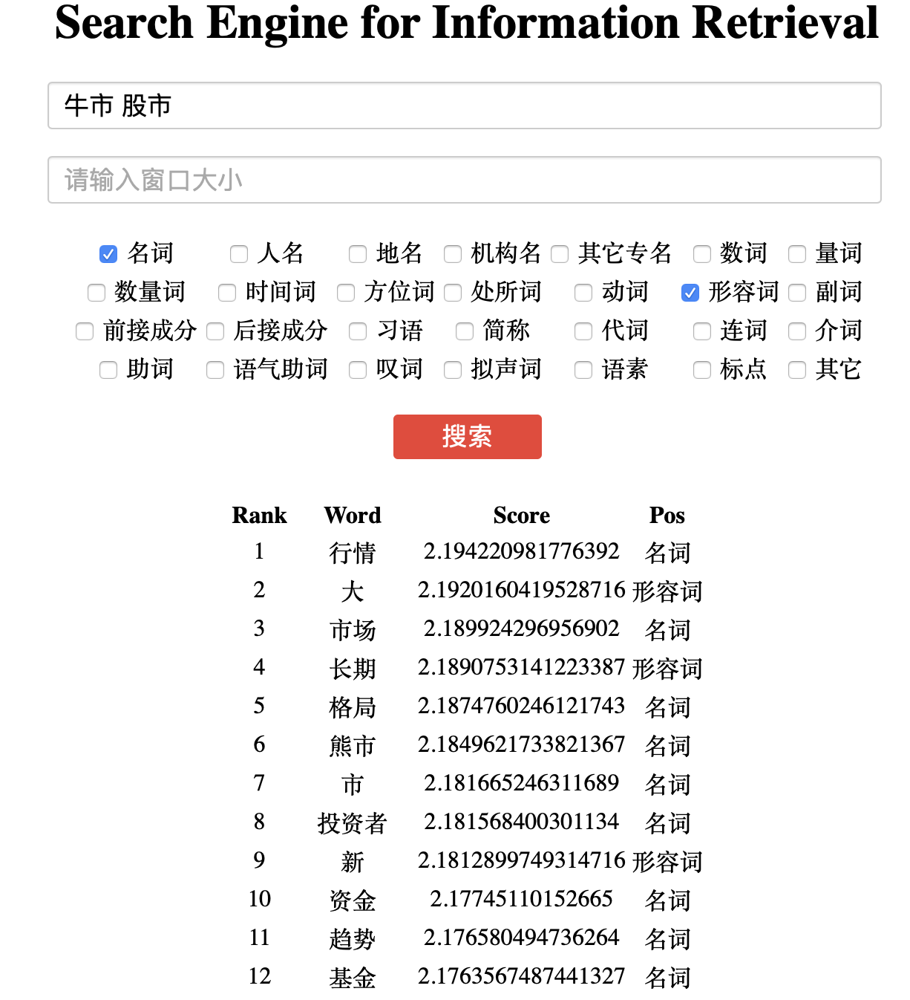

# 
中文搭配检索系统大作业

黄宇飞 2016011259

## 项目目标

实现一个完整的信息检索系统并达到以下的目的：

+ 对大规模中文文本分词（已在之前的作业中完成）
+ 给定关键词，查询出相对应的搭配，并考虑如下场景：
  + 给定返回词常见搭配的结果（列表）
  + 给定返回关键词词性，返回常见的搭配列表
  + 给定检索词和关键词的距离限制，返回常见搭配的结果（窗口）
  + 给定多个关键词返回相应的结果
  + 分词或不分词对检索系统的影响
+ 最终形成报告以及展示系统

## 项目实现

本次作业使用了Elasticsearch来构建索引以及完成document的检索过程，使用flask框架搭建简易的可供展示的系统，使用thulac作为分词和词性标注的工具，使用python3.7作为编程语言实现。

其中项目运行流程和各个外部包的版本参看[README.md](../README.md)

代码全部上传至github：https://github.com/huangyf530/IRHomeWork

本次作业实现的流程如下：

#### 分词和词性标注

使用THULAC作为分词和词性标注工具对SogouT的数据进行分词和词性标注。本任务作为大作业的一个子任务，在前几次的作业中已经由各组分别完成对应部分，本次作业主要是使用了其中的一部分处理好的数据。具体来说，使用了**SogouT0002**和**SogouT0012**的数据，共**72889996**个句子，作为基础的语料库。

#### 构建索引

索引的构建使用了Elasticsearch这个工具，很方便的对每一个句子建立了索引，建立索引的过程如下：

1. 对于每一句话，使用thulac处理之后的文件，通过正则表达式获得两个列表，分别表示该句子中的词和每个词对应的词性。
2. 使用停用词，在网上下载了一个停用词表，检查句子中的每个词是否出现在停用词表中，如果是，则去除。
3. 每200000个句子进行一次批量建立到排列表，最终得到所有句子组成的到排列表。

#### 查询与搜索

使用Flask搭建了基本的检索框架，通过在界面中设置搜索的关键词、窗口大小以及词性，用于检索。

检索时首先对关键词按照空格进行分割，获得一个关键词的列表，并按照 ElasticSearch的方法对构建检索，并返回得到评分最高的10000个包含所有关键词的句子（有可能小于10000），然后对这些句子中的词进行新一轮的分数计算。具体方式如下：

1. 取出关键词周围windowsize的窗口大小的词，过滤掉不符合要求词性的词，之后计算并记录每个词出现的频率和距离关键词的距离。
2. 之后对所有的词计算其分数，采用类似tf-idf的方式计算，分数的定义如下：$\frac{f_i \times (k_1 + 1)}{f_i + k_1\times(1-b+b\times \frac{dis}{window})}$ 。其中$k_1$和$b$ 是取的超参数，分别为1.2和0.75。$f_i$表示这个词出现的次数。从这个公式中可以看出，出现次数越高，距离关键词越近，该词的评分越高。

### 效果展示

使用python运行app.py之后，可以在http://localhost:5000进入我们的搜索界面。主页面的样式如下：

第一个输入框用于输入查询的关键词，第二个输入框用于输入窗口的大小（不设置会默认为5），再往下是设置返回词的词性。

输入检索信息之后会在下面展示检索结果。如检索“牛市 ”得到如下结果：

可以看到与**“牛市”**常见的搭配有“行情”、“市场”、“股市”、“基金”、“熊市”等。当限制结果只有“名词”和“形容词”之后，结果如下：

可以看到结果中都是与股票相关的词，说明结果还是比较不错的。再进一步使用多个关键词进行检索，如使用**“牛市 股市”**进行检索，得到以下的几个检索结果：

可以看到，加入第二个关键词之后，结果的顺序和评分有了一定的变化，排名靠前的词也更多的与股票相关，说明多关键词在检索时起到了应有的作用。

## 总结

本次作业完成了基本的中文搭配检索系统，通过了一个自定义的类似于tf-idf的算法，对得到的结果排序，取得了不错的结果。但在相关性和检索的准确性和效率上还有可以提高的地方，之后可以考虑引入词向量等更好的方式来提高检索结果的相关性以及优化整个系统的运行效率。