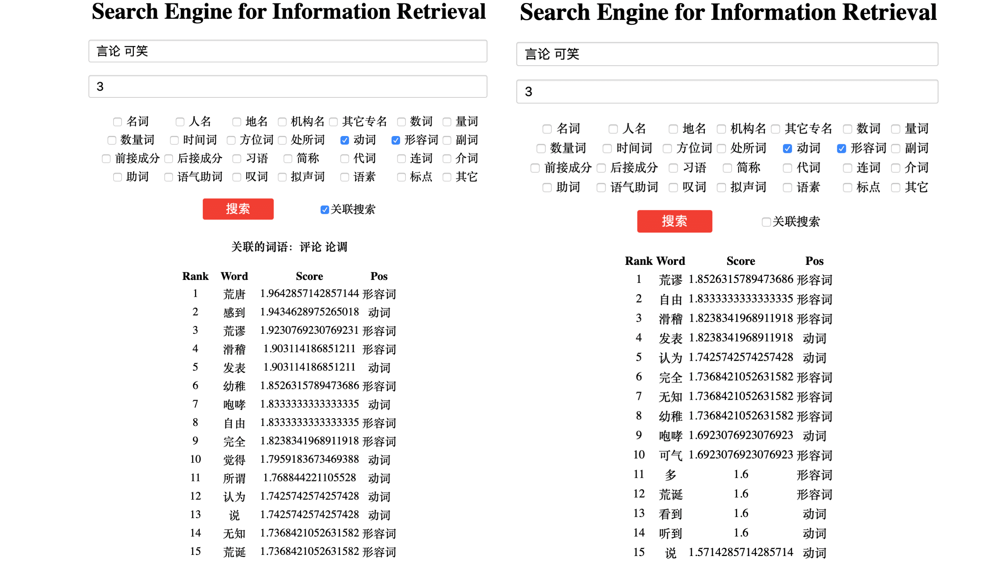

# 
信息检索之功能扩展

黄宇飞 2016011259

## 作业目标

在第3次作业“中文搭配检索系统的实现”已经完成的检索系统的基础上，结合其后所学的任何知识，拓展至少一项你认为有意思的检索功能。并给出实验结果（包括增加该项功能前后检索效果的比较）及必要的相关分析等。

## 拓展功能

+ 实现了基于word vector的关联搜索，即通过预先训练好的word vector得到与查询词意思相近的词语。在搜索查询词的搭配的同时可以检索查询词同义词的搭配，进而得到更加丰富和准确的结果。

## 实验过程与结果

首先使用gensim对前4000000个句子中的所有词进行word2vec的训练，经过20轮的训练得到一个比较好的wordvector并存储。

在运行flask的主程序时，首先load已经训练好的word vector，在查询时，如果启用关联查询的选项，通过word vector查找与查询词（多个查询词时取第一个）最接近的5个词语，并判断其相似度需要大于0.64，这样的词作为候选词，在对索引进行查询的过程中讲这些候选词作为单独的查询词（多个关键词时与其他关键词组合）进行查询，对所有得到的结果一起进行统计，进而得到优化排序结果和丰富度的效果。

这样的想法是基于，同义词或近义词会有类似的搭配，如“苹果”和“梨”都可以和“好吃的”、“美味的”、“吃”等这些词搭配，所以通过使用word vector找到近义词，可以对结果的丰富度和准确度有一个更好的提高。

本次作业的代码依然放置在github：https://github.com/huangyf530/IRHomeWork

## 实验效果展示

实验中对使用"言论 可笑"二个关键词进行搜索，windowsize为3，同时只勾选动词和形容词两个选项，对启用关联搜索和不启用关联搜索的结果进行比较如下：

首先启用关联搜索之后，关联到的词语有“评论”、“论调”

1. 数量上，启用关联搜索后得到的搭配词的数量为140，不启用关联搜索得到的结果的数量为77个，在丰富性上，启用关联搜索可以得到更多的结果，这一点也是可以预想到的。而且多出来的结果并不是没有意义的，如“失实”、“痛斥”、“可怕”等词，都是在不启用关联搜索时无法看到的，这些词却可以通过关联搜索得到，并与查询的契合度很高，说明使用关联搜索确实一定程度上可以使结果更加丰富。

2. 加入关联搜索之后对结果的排序有了一定的影响，同样已改查询为例，启用关联搜索和不启用关联搜索的结果如下：

   

可以看到，在不同的选项下，排名前15位的结果在内容和排序上都有着一定的区别。

右侧没有启用关联搜索的结果中，结果看上去已经不错，但是“自由”、“完全”、“多”这些词实际上和“可笑”的关系并不是很大。在左侧启用关联搜索之后的结果中，“自由“、”完全“、的排名由欧大幅度下降，”多“这个词已经没有出现在前15位中，在这个例子中，关联搜索对结果的重排序使这些不太相关的词的位置向下移动，进而优化了排序的结果。

## 实验总结

本次通过引入word vector来对搭配的返回结果进行优化，取得了一定的效果，说明word vector在这个问题下有着一定的作用。但由于计算机运算能力的问题以及语料库规模过大，本次实验并没有对所有数据训练词向量，可能对于一些查询词并没有对应的词向量，也是这次作业一个遗憾的地方。